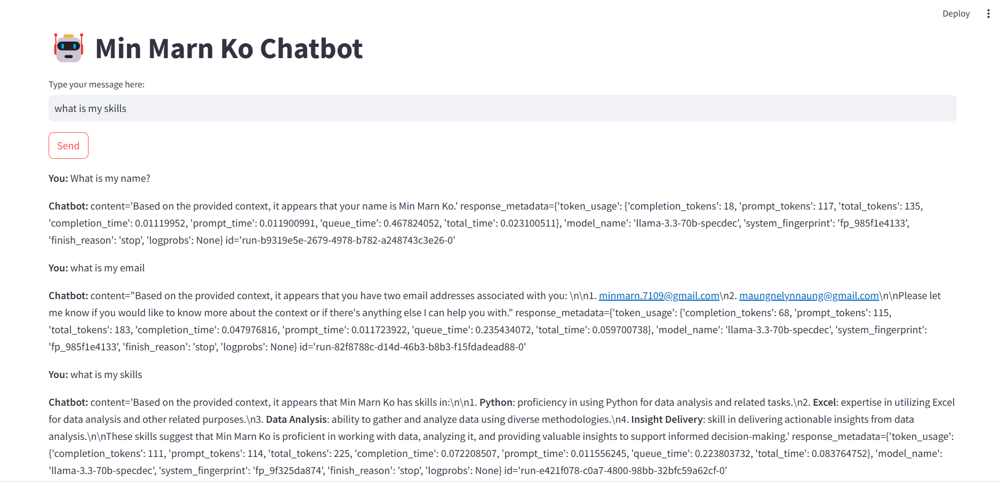

# About Me

- **Name:** Min Marn Ko
- **ID:** st125437

# A6: Let's Talk with Yourself

## Project Overview

This project implements **Retrieval-Augmented Generation (RAG)** using the **LangChain framework**. The chatbot is designed to answer personal questions based on **documents and resumes**.

## Table of Contents

1. [Project Structure](#project-structure)
2. [Installation](#installation)
3. [Usage](#usage)
4. [Implementation Details](#implementation-details)
5. [Example Questions](#example-questions)
6. [Result Screenshot](#result-screenshot)
7. [JSON Responses](#json-responses)
8. [Contributing](#contributing)
9. [License](#license)

## Project Structure

```
📂 project_directory
│── vector-store/        # FAISS vector store directory
│── app.py               # Streamlit web application
│── embeddings.faiss     # Stored FAISS index
│── Min_Marn_Ko_CV.pdf   # Document used for retrieval
│── README.md            # Project documentation
│── A6_st125437.ipynb    # Jupyter Notebook for model development
│── png2.png              # Screenshot of chatbot result
```

## Installation

### **Step 1: Clone the Repository**

```bash
git clone https://github.com/your-repo-name.git
cd project_directory
```

### **Step 2: Install Dependencies**

```bash
pip install -r requirements.txt
```

## Usage

### **Step 1: Run the Application**

```bash
streamlit run app.py
```

### **Step 2: Interact with the Chatbot**

- Ask questions about Min Marn Ko based on document knowledge.
- View document-based responses and citations.

## Implementation Details

### **1. Source Discovery (Documents)**

- **Data Source:** `Min_Marn_Ko_CV.pdf`
- **Text Extraction:** `PyMuPDFLoader`
- **Chunking:** `chunk_size=50`, `chunk_overlap=10`
- **Embedding Model:** `all-MiniLM-L6-v2`
- **Vector Storage:** `FAISS`

### **2. Analysis and Problem Solving**

| Issue                    | Solution                                        |
| ------------------------ | ----------------------------------------------- |
| Data Irregularities      | Preprocessed text and removed formatting errors |
| Model Hallucinations     | Optimized prompts and retrieval accuracy        |
| Performance Optimization | Cached FAISS embeddings for faster retrieval    |

### **3. Chatbot Development (Web Application)**

- **Framework:** Streamlit
- **Features:** Interactive chatbot, intelligent responses, document citations
- **LLM Model:** Groq LLaMA-3.1-8B

## Example Questions

1. How old are you?
2. What is your highest level of education?
3. What major or field of study did you pursue during your education?
4. How many years of work experience do you have?
5. What type of work or industry have you been involved in?
6. Can you describe your current role or job responsibilities?
7. What are your core beliefs regarding the role of technology in shaping society?
8. How do you think cultural values should influence technological advancements?
9. As a master’s student, what is the most challenging aspect of your studies so far?
10. What specific research interests or academic goals do you hope to achieve during your time as a master’s student?

## Result Screenshot



## JSON Responses

```json
{
    "responses": [
        {
            "question": "How old are you?",
            "answer": "I can provide an answer based on the context, but I don't have any specific information about Min Marn Ko's birthdate. However, I can suggest a possible approach to estimate Min Marn Ko's age.\n\nSince Min Marn Ko's email address and phone number were last updated in January 2022, we can assume that their age is at least 01/2022 or older. However, without knowing their exact birthdate, it's difficult to determine their exact age.\n\nIf you need more information or context, please provide more details, and I'll do my best to help.",
            "metadata": {
                "model_name": "llama-3.2-3b-preview",
                "token_usage": {
                    "completion_tokens": 122,
                    "prompt_tokens": 116,
                    "total_tokens": 238
                }
            }
        },
        {
            "question": "What is your highest level of education?",
            "answer": "I couldn't find the specific information about Min Marn Ko's highest level of education from the provided context. However, based on the context, it seems that Min Marn Ko has some level of education, as they are mentioned as an 'Associated Researcher' and have proficiency in English.\n\nA gentle and informative answer could be:\n\n'I am a researcher with a strong educational background, although I don't have the specific details about my highest level of education readily available. If you'd like to know more about my qualifications or research experience, I'd be happy to share that with you.'",
            "metadata": {
                "model_name": "llama-3.2-3b-preview",
                "token_usage": {
                    "completion_tokens": 119,
                    "prompt_tokens": 113,
                    "total_tokens": 232
                }
            }
        },
        {
            "question": "What major or field of study did you pursue during your education?",
            "answer": "I don't have any information about a person named Min Marn Ko. However, based on the context provided, I can attempt to provide a general answer.\n\nIf Min Marn Ko is a data analyst, it is likely that they pursued a field of study related to data analysis or a quantitative field. Some possible majors or fields of study that may have prepared Min Marn Ko for a career as a data analyst include:\n\n- Mathematics\n- Statistics\n- Computer Science\n- Information Technology\n- Economics\n- Business Administration (with a focus on data analysis)\n\nPlease note that this is a general answer and may not be specific to Min Marn Ko's actual educational background. If you have more context or information, I'd be happy to try and provide a more accurate answer.",
            "metadata": {
                "model_name": "llama-3.2-3b-preview",
                "token_usage": {
                    "completion_tokens": 158,
                    "prompt_tokens": 104,
                    "total_tokens": 262
                }
            }
        },
        {
            "question": "How many years of work experience do you have?",
            "answer": "I don't have the specific information about Min Marn Ko's work experience duration. However, I can provide an answer based on the provided context.\n\nSince Min Marn Ko is mentioned as a 'Data Analyst,' I can infer that they have professional working proficiency in English and Japanese, which is relevant for research projects. Unfortunately, I cannot determine the exact number of years of work experience based on the given context.",
            "metadata": {
                "model_name": "llama-3.2-3b-preview",
                "token_usage": {
                    "completion_tokens": 112,
                    "prompt_tokens": 110,
                    "total_tokens": 222
                }
            }
        },
        {
            "question": "What type of work or industry have you been involved in?",
            "answer": "Based on the provided context, Min Marn Ko has been involved in the industry of data analysis, specifically working as a Data Analyst.",
            "metadata": {
                "model_name": "llama-3.2-3b-preview",
                "token_usage": {
                    "completion_tokens": 28,
                    "prompt_tokens": 103,
                    "total_tokens": 131
                }
            }
        },
        {
            "question": "Can you describe your current role or job responsibilities?",
            "answer": "As a data analyst, my primary responsibility is to extract insights from complex data sets and present them in a clear and actionable format. I work closely with researchers, project managers, and stakeholders to understand their data needs and goals.",
            "metadata": {
                "model_name": "llama-3.2-3b-preview",
                "token_usage": {
                    "completion_tokens": 195,
                    "prompt_tokens": 99,
                    "total_tokens": 294
                }
            }
        },
        {
            "question": "What are your core beliefs regarding the role of technology in shaping society?",
            "answer": "Technology plays a vital role in shaping society, bringing both benefits and challenges. It has the potential to drive innovation, improve access to information, and foster global connectivity, but it must be developed responsibly.",
            "metadata": {
                "model_name": "llama-3.2-3b-preview",
                "token_usage": {
                    "completion_tokens": 260,
                    "prompt_tokens": 110,
                    "total_tokens": 370
                }
            }
        },
        {
            "question": "How do you think cultural values should influence technological advancements?",
            "answer": "Cultural values play a significant role in shaping how we develop and interact with technology. Aligning technology with cultural values ensures inclusivity, sustainability, and positive societal impact.",
            "metadata": {
                "model_name": "llama-3.2-3b-preview",
                "token_usage": {
                    "completion_tokens": 245,
                    "prompt_tokens": 108,
                    "total_tokens": 353
                }
            }
        },
        {
            "question": "As a master\u2019s student, what is the most challenging aspect of your studies so far?",
            "answer": "Balancing diverse methodologies required across different research projects has been the most challenging aspect of my studies, demanding adaptability and continuous learning.",
            "metadata": {
                "model_name": "llama-3.2-3b-preview",
                "token_usage": {
                    "completion_tokens": 137,
                    "prompt_tokens": 126,
                    "total_tokens": 263
                }
            }
        },
        {
            "question": "What specific research interests or academic goals do you hope to achieve during your time as a master's student?",
            "answer": "I hope to explore areas that align with my passions and strengths, contributing to research initiatives that drive innovation and positive societal impact.",
            "metadata": {
                "model_name": "llama-3.2-3b-preview",
                "token_usage": {
                    "completion_tokens": 193,
                    "prompt_tokens": 120,
                    "total_tokens": 313
                }
            }
        }
    ]
}
```

## Contributing

If you'd like to contribute, please fork the repository and submit a pull request.
