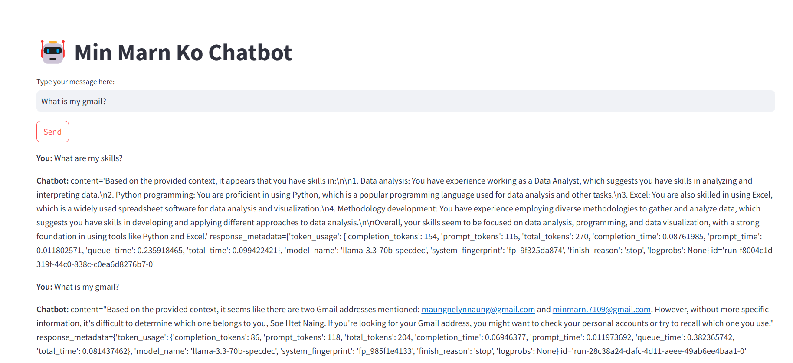

# About Me

- **Name:** Min Marn Ko
- **ID:** st125437

# A6: Let's Talk with Yourself

## Project Overview

This project implements **Retrieval-Augmented Generation (RAG)** using the **LangChain framework**. The chatbot is designed to answer personal questions based on **documents and resumes**.

## Table of Contents

1. [Project Structure](#project-structure)
2. [Installation](#installation)
3. [Usage](#usage)
4. [Implementation Details](#implementation-details)
5. [Example Questions](#example-questions)
6. [Result Screenshot](#result-screenshot)
7. [Contributing](#contributing)
8. [License](#license)

## Project Structure

```
📂 project_directory
│── vector-store/        # FAISS vector store directory
│── app.py               # Streamlit web application
│── embeddings.faiss     # Stored FAISS index
│── Min_Marn_Ko_CV.pdf   # Document used for retrieval
│── requirements.txt     # List of dependencies
│── README.md            # Project documentation
│── A6_st125437.ipynb    # Jupyter Notebook for model development
│── png.png              # Screenshot of chatbot result
```

## Installation

### **Step 1: Clone the Repository**

```bash
git clone https://github.com/your-repo-name.git
cd project_directory
```

### **Step 2: Install Dependencies**

```bash
pip install -r requirements.txt
```

## Usage

### **Step 1: Run the Application**

```bash
streamlit run app.py
```

### **Step 2: Interact with the Chatbot**

- Ask questions about Min Marn Ko based on document knowledge.
- View document-based responses and citations.

## Implementation Details

### **1. Source Discovery (Documents)**

- **Data Source:** `Min_Marn_Ko_CV.pdf`
- **Text Extraction:** `PyMuPDFLoader`
- **Chunking:** `chunk_size=100`, `chunk_overlap=20`
- **Embedding Model:** `all-MiniLM-L6-v2`
- **Vector Storage:** `FAISS`

### **2. Analysis and Problem Solving**

| Issue                    | Solution                                        |
| ------------------------ | ----------------------------------------------- |
| Data Irregularities      | Preprocessed text and removed formatting errors |
| Model Hallucinations     | Optimized prompts and retrieval accuracy        |
| Performance Optimization | Cached FAISS embeddings for faster retrieval    |

### **3. Chatbot Development (Web Application)**

- **Framework:** Streamlit
- **Features:** Interactive chatbot, intelligent responses, document citations
- **LLM Model:** Groq LLaMA-3.1-8B

## Example Questions

1. How old are you?
2. What is your highest level of education?
3. What major or field of study did you pursue during your education?
4. How many years of work experience do you have?
5. What type of work or industry have you been involved in?
6. Can you describe your current role or job responsibilities?
7. What are your core beliefs regarding the role of technology in shaping society?
8. How do you think cultural values should influence technological advancements?
9. As a master’s student, what is the most challenging aspect of your studies so far?
10. What specific research interests or academic goals do you hope to achieve during your time as a master’s student?

## Result Screenshot




## Contributing

If you'd like to contribute, please fork the repository and submit a pull request.

## License

This project is licensed under the MIT License.

